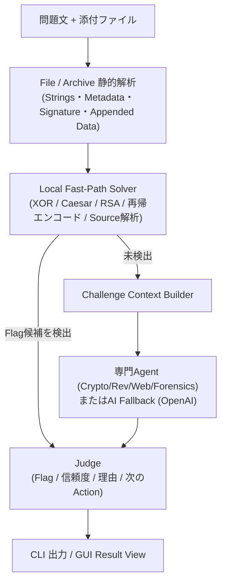
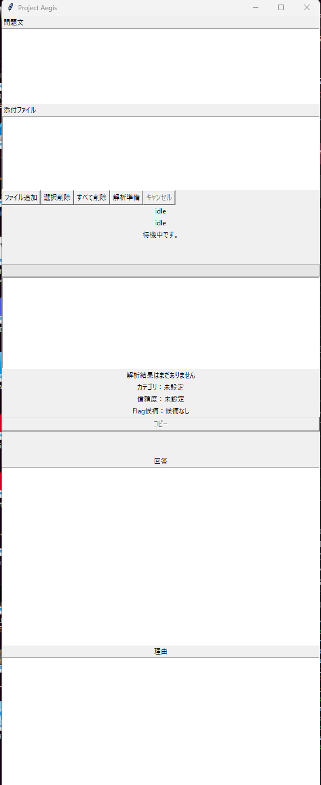
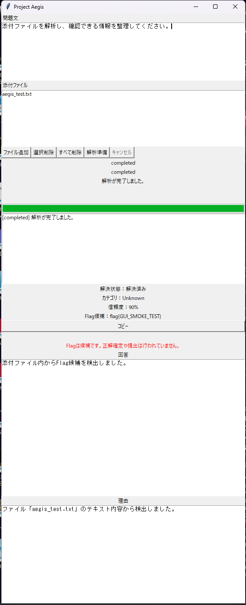

# Project Aegis Analyzer

CTF（Capture The Flag）の添付ファイルをローカルで安全に静的解析し、重要な情報・Flag候補・AI推論用のContextへ構造化して整理する、**local-first** な解析支援アプリケーションです。Windows向けに、GUI（Tkinter）とCLIの両方を提供します。

> **これは「AIが自動でCTFを全部解くツール」ではありません。** まずローカルの静的解析だけでFlag候補の検出を試み、それで解決できない場合に限って専門AgentやOpenAIへの問い合わせを行います。Agent・Tool・AI・コード実行が返すFlagはすべて**候補**であり、正解確定や自動提出を意味しません。

---

## Overview

CTFの問題は、Archive・Source Code・画像・文書・実行Binary・エンコード済みデータなど、毎回入力形式がバラバラです。問題ごとに手作業で「これは何のFile形式か」「怪しい文字列や埋め込みデータはないか」「末尾に余分なデータが付いていないか」を調べる初期調査コストが発生します。

Project Aegis Analyzerは、この初期調査を安全なローカル静的解析で自動化し、調査開始までの時間を短縮する目的で開発しました。設計上取り組んだ課題は、

**「不定形な入力（未知のFile群）を、実行せずに安全に解析し、構造化された情報へ変換する」**

というものです。ファイルを実行せずに特徴抽出する解析基盤、Agentによる分野別解析、承認制のコード実行、そして解析全体を貫くFailure Safety設計を通じて、この課題に取り組んでいます。

---

## Key Features

現在実装済みの機能のみを記載しています。

**Archive**
- ZIP / TAR / GZIP
- Archive内Child Fileの再帰解析
- Path Traversal（絶対パス・親ディレクトリ脱出）の検出と拒否

**File Analysis**
- PNG / JPEG（Metadata・埋め込みComment・末尾追加データ）
- PDF（構造解析・Metadata・末尾追加データ）
- WAV（Chunk構造・Metadata・末尾追加データ）
- PE（セクション・EntryPoint・Overlay候補）
- ELF（Segment / Section・Interpreter・末尾追加データ候補）

**Static Analysis**
- ASCII / UTF-16LE Strings抽出
- File Signature判定
- 末尾追加データ（Appended Data）検出
- Rev（リバースエンジニアリング）向け重要手掛かり抽出

**Crypto / Encoding**
- RSA（Fermat分解・Common Modulus等の複数攻撃手法）
- 単一バイトXOR
- Caesar / ROT
- 再帰エンコード解析（Base64等の多重変換を自動追跡）
- Universal Encoding解析

**Source Code解析**
- Python（難読化・変数復元）
- Java（文字列比較・Flag埋め込みパターン）

**Application**
- Tkinter製GUI（入力・進捗・結果・Agent結果・承認・Budget表示）
- Flag候補検出とClipboardへのCopy
- Challenge Context生成（解析結果をAI推論用Textへ構造化）
- 生成コード実行のUser承認フロー
- 外部Tool（strings / file / exiftool / readelf / objdump / nm / binwalk）のAllowlist Policy制御
- Iteration / AI呼び出しBudget管理
- Failure Safety（壊れたFile・未対応Formatでも解析全体を継続）
- 環境診断（API通信・外部Tool実行を伴わない事前チェック）

---

## Architecture



ローカル解析だけでFlagが見つかった場合はAI呼び出しを行わず（`local_solution_avoided_ai`）、見つからなかった場合のみ専門AgentまたはAI Fallbackへ進みます。Analysis（`app/file`, `app/solver`）・Controller（`app/controller`, `app/challenge`）・Presentation（`app/presentation`）・GUI（`app/gui`）は明確にLayer分離されています。

---

## Safety Design

「完全に安全」であるとは主張しません。実装済みの安全境界のみを記載します。

- **無断実行の禁止**：生成Pythonコードの実行にはUser承認が必須で、承認前にプロセスを起動しません
- **実行分離**：承認後の実行は別Processで行い、Timeoutを強制し、stdinを無効化します
- **環境変数の非継承**：子ProcessへParentのSensitive環境変数を継承しません
- **Archive安全性**：ZIP/TARのPath Traversal（絶対パス・`..`脱出）を拒否し、Nested Archiveを無制限に自動展開しません
- **外部Tool Allowlist**：strings/file/exiftool等はPolicyに登録済みの引数パターンのみ実行可能です（任意Shell実行やPATH検索は行いません）
- **Budget制御**：Challengeあたりの反復回数・AI呼び出し回数に上限を設け、超過時は拒否します
- **Failure Safety**：壊れたArchive・未対応Format・Parser内部Exceptionを解析全体のCrashにせず、安全に処理を継続します
- **Secret非露出**：APIキー等をLog・画面出力・配布Fileへ含めないことをTestで検証しています
- **危険API不使用**：Runtime SourceコードにShell=True・eval・exec・強制Thread終了を含まないことをTestで検証しています

**運用上の注意（既存の重要な制約）**

- 生成Pythonコードの制限付き実行は完全なサンドボックスではありません。内容と静的検査結果を確認し、明示承認した場合だけ実行してください。
- Agent、Tool、コード実行出力のFlagは候補であり、正解確定や自動提出ではありません。
- キャンセルは未開始のAI通信を抑止しますが、既に開始済みの通信や処理を強制終了しません。
- 実マルウェアや信頼できない生成コードを実行しないでください。

---

## Supported Formats

| Category | Supported |
| --- | --- |
| Archive | ZIP, TAR, GZIP |
| Image | PNG, JPEG |
| Document | PDF |
| Audio | WAV |
| Executable | PE, ELF |
| Source Code | Python, Java |

---

## Engineering Highlights

- **Modular Analyzer設計**：Format単位（PNG/JPEG/PDF/WAV/PE/ELF/Archive）で独立したAnalyzer＋Result DTOに分離
- **Failure-Safe Parsing**：Corrupt Fileや未対応構造でも例外を外へ漏らさず、60件超のFailure Case Catalogで回帰検証
- **Security Boundary**：コード実行承認・外部Tool Allowlist・Archive Path Traversal対策・Budget制御を個別にTestで固定
- **明確なLayer分離**：`analyzer` / `controller` / `challenge` / `presentation` / `gui` をDirectory単位で分離
- **Local-First処理**：Flagがローカル解析だけで見つかる場合はAI呼び出しを行わない設計（Fast-Path）
- **限定的な外部依存**：`requirements.txt`は5パッケージのみ（本体はPython標準Library中心）

---

## Testing

```powershell
.\.venv\Scripts\python.exe -m pytest -q
.\.venv\Scripts\python.exe -m ruff check app tests
git diff --check
```

現時点の実測値：

- pytest：**2098 passed**
- Ruff：**All checks passed**

Archive Path Traversal、コード実行承認境界、外部ToolのAllowlist検証、Failure Safety Catalog、Distribution/Release Readiness（Secret非露出・README記載とEntry Pointの一致等）を含む2000件超の自動Testで構成されています。

---

## Quick Start

Windows 10/11 + Python 3.11以上 + PowerShell 5.1以上を想定しています。

```powershell
git clone https://github.com/dan-kichi99/project-aegis-analyzer.git
cd project-aegis-analyzer

py -3 -m venv .venv
.\.venv\Scripts\python.exe -m pip install -r requirements.txt
Copy-Item .env.example .env
```

OpenAI機能を使う場合だけ、`.env`または環境変数へ`OPENAI_API_KEY`を設定してください。キーが未設定でも、GUI起動とローカル静的解析（AI呼び出しを伴わないFast-Path解析）は利用できます。APIキー・Token・個人パスをGitへ追加しないでください。

**GUI起動**

```powershell
.\scripts\run_gui.ps1
# または
.\.venv\Scripts\python.exe -m app.gui_main
```

**CLI起動**

```powershell
.\scripts\run_cli.ps1
# または
.\.venv\Scripts\python.exe -m app.main
```

**環境診断**（API通信・外部Tool実行を行わない事前チェック）

```powershell
.\scripts\check_environment.ps1
# または
.\.venv\Scripts\python.exe -m app.diagnostics_main
```

---

## Usage（GUI）

1. 「問題文」欄にCTFの問題文を入力する
2. 「ファイル追加」ボタンで添付ファイルを追加する（複数可、「選択削除」「すべて削除」で調整可能）
3. 「解析準備」ボタンをクリックして解析を開始する（進捗はProgress欄に表示される）
4. 解析完了後、結果欄で「解決状態」「カテゴリ」「信頼度」「Flag候補」「回答」「理由」「次のAction」を確認する
5. 「Flag候補」ラベルをDouble-Click、または「コピー」ボタンをクリックしてClipboardへCopyする

---

## Screenshots

**GUI初期画面**（起動直後の問題文・添付ファイル入力画面）



**解析結果画面**（解析完了後、Flag候補・回答・理由が表示された画面）



---

## Demo

30〜60秒のDemo操作手順は [docs/DEMO.md](docs/DEMO.md) を参照してください。第三者のCTF問題は使用せず、自作Sample Fileのみを使用する構成です。

---

## Project Status

- VERSION：v1.0.0（詳細は [CHANGELOG.md](CHANGELOG.md) を参照）
- 本Repositoryは PyInstaller、exe、MSI、インストーラー、自動更新を提供していません
- Release前チェックリストは [RELEASE_CHECKLIST.md](RELEASE_CHECKLIST.md) を参照してください
